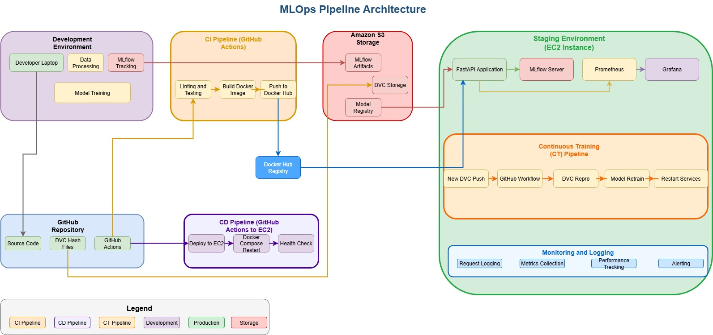

# MLOps Assignment: End-to-End Pipeline for California Housing
This repo contains the code base for MLOPs assignment by Group 31
---

## Contributors:
| Member Name        | BITS ID      | Contribution |
|--------------------|--------------|--------------|
| Abhilash Raj       | 2023AC05043  | 100%         |
| Swapnanil Seal     | 2023AC05013  | 100%         |
| Anurag Sujan       | 2023AC05003  | 100%         |
| Manoj Kumar Sharma | 2023AC05845  | 100%         |

## Overview

This project demonstrates a minimal but complete MLOps pipeline for a machine learning model using the California Housing dataset. The pipeline covers data versioning, experiment tracking, model packaging, CI/CD/CT, deployment, and monitoring.

---

## Architecture

### Architecture Block Diagram

- **Local (Dev):** Experimentation, data versioning, and initial model development.
- **Staging (EC2):** Centralized MLflow tracking, model registry, API deployment, monitoring, and CI/CD runner.
- **Data Storage:** S3 bucket for DVC-tracked data and MLflow artifacts.
- **API:** FastAPI, containerized with Docker and orchestrated via Docker Compose.
- **Monitoring:** Prometheus and Grafana for metrics and dashboards.

---

## Key Technologies

- **Git + GitHub:** Source code and workflow management.
- **DVC:** Data versioning and pipeline orchestration.
- **MLflow:** Experiment tracking, model registry, and artifact storage.
- **FastAPI:** REST API for model inference.
- **Docker & Docker Compose:** Containerization and orchestration.
- **GitHub Actions:** CI/CD/CT for linting, testing, building, deployment and retraining.
- **Prometheus & Grafana:** Monitoring and visualization.
- **Logging:** Python logging module for request/response logging.

---

## Pipeline Steps

### 1. Repository & Data Versioning

- GitHub repository with clean structure.
- California Housing dataset tracked with DVC.
- Data stored in S3 (`s3://mlops-assignment-ca-housing/dvc-storage`).
- DVC hash files committed to GitHub.

### 2. Model Development & Experiment Tracking

- Multiple models trained (e.g., Linear Regression, Decision Tree).
- MLflow used for tracking parameters, metrics, and artifacts.
- Best model registered and promoted to "Staging" in MLflow.

### 3. API & Docker Packaging

- FastAPI app for prediction, accepting JSON input.
- Dockerfile for containerization.
- Docker Compose for orchestrating API, MLflow, Prometheus, and Grafana.

### 4. CI/CD with GitHub Actions

- Linting and unit tests on pull requests.
- Build and push Docker image to Docker Hub on merge.
- Deployment pipeline triggers on main branch updates.
- Build runs on GitHub-hosted runner; deployment runs on EC2 via self-hosted runner.

### 5. Logging & Monitoring

- All prediction requests and outputs logged to file.
- Prometheus scrapes API metrics; Grafana dashboards visualize them.

### 6. Automated Retraining

- When new data is pushed via DVC to the main branch, GitHub Actions triggers the DVC pipeline:
  - Data preprocessing
  - Model retraining and MLflow tracking
  - Model registration and promotion
  - Docker Compose restart to deploy the new model

---

## Usage

1. **Clone the repository and install requirements.**
2. **Configure DVC remote to your S3 bucket.**
3. **Run experiments locally and push results to MLflow and S3.**
4. **Push code and DVC hashes to GitHub.**
5. **CI/CD pipeline handles testing, building, and deployment.**
6. **API is available for predictions; monitoring available via Grafana.**

---

## Bonus Features

- Input validation with Pydantic in FastAPI.
- Prometheus integration and Grafana dashboard.
- Automated retraining pipeline triggered by new data.

---

## Credits

- California Housing dataset (public domain)
- Open-source tools: DVC, MLflow, FastAPI, Docker, Prometheus, Grafana

---

*For setup and usage details, see the individual scripts and configuration files in this repository.*
